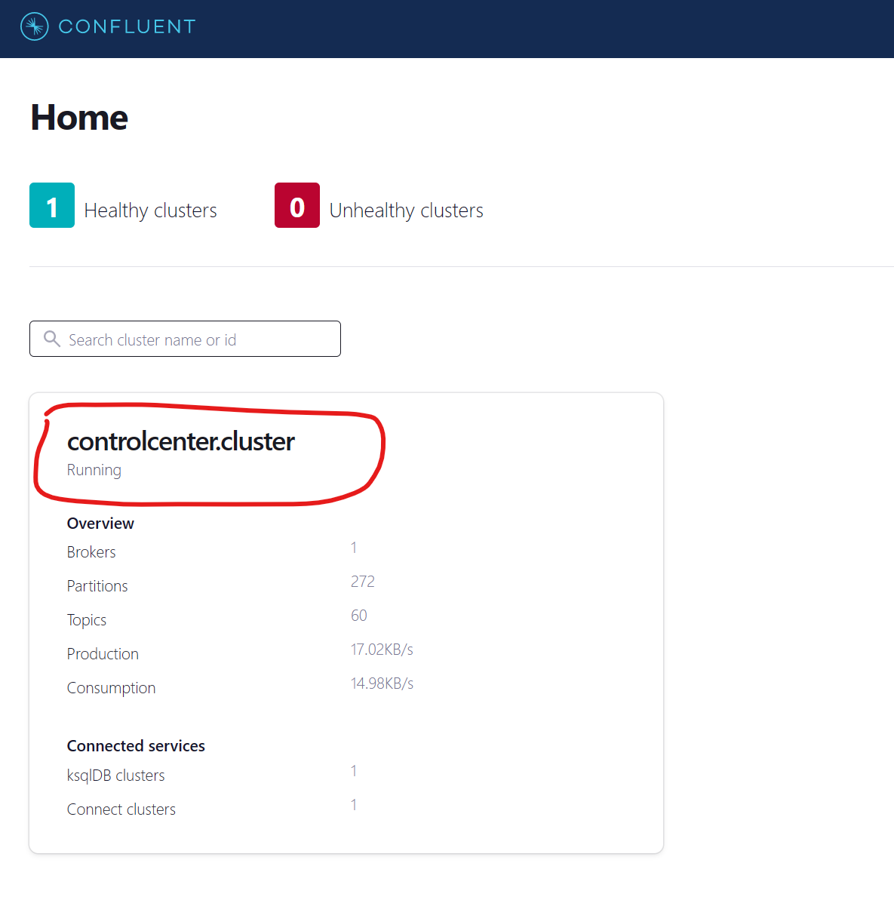
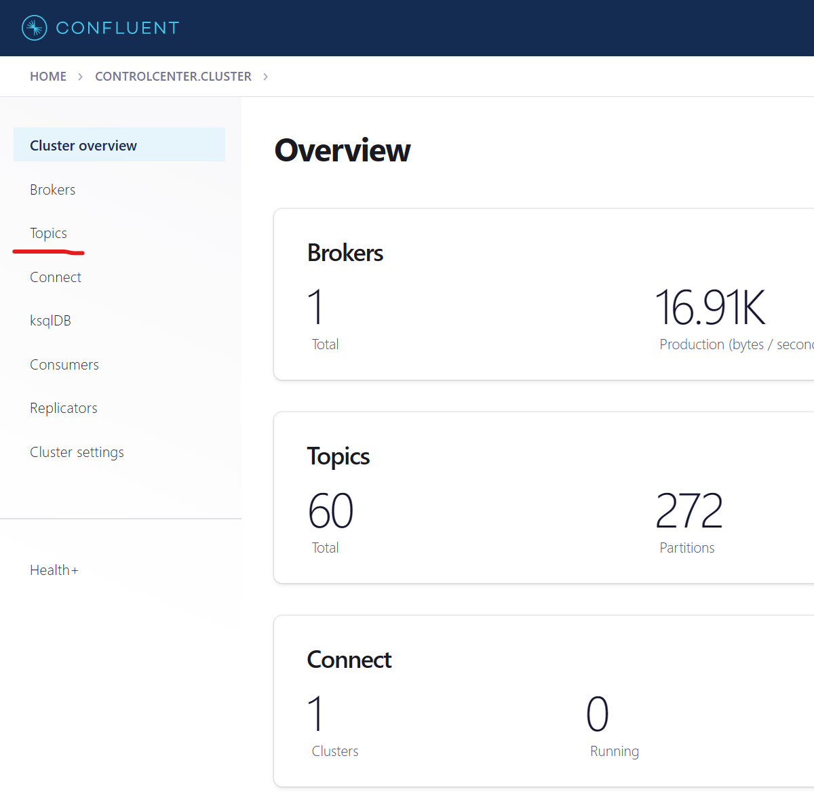
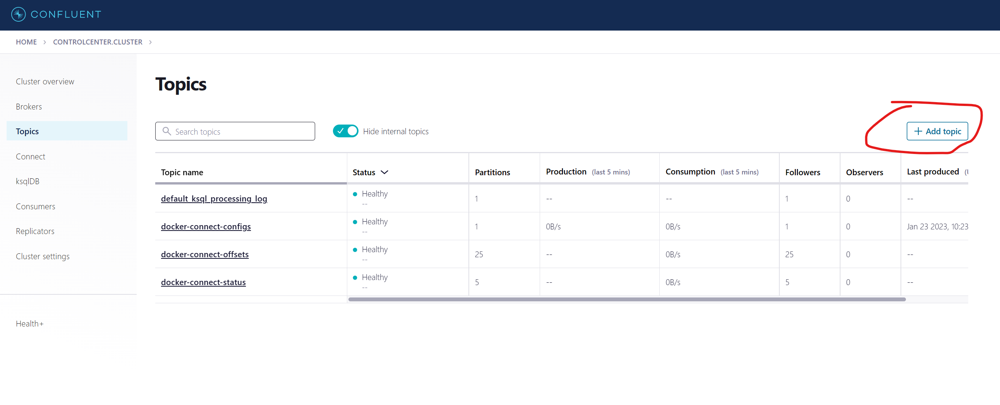
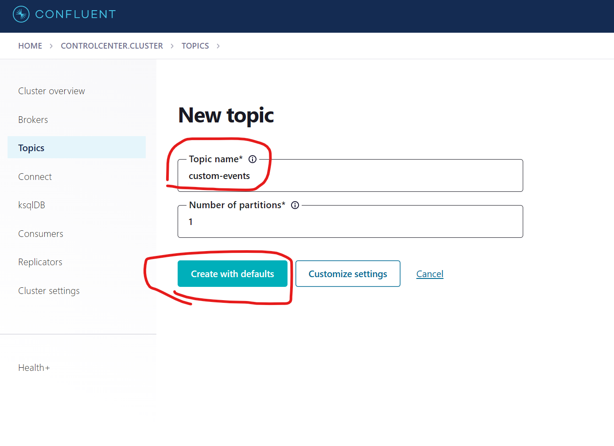

# Azure Function (Python) with Apache Kafka trigger and output binding

This repo creates a Visual Studio Code devcontainer setup for [Python-based Azure Functions](https://learn.microsoft.com/en-us/azure/azure-functions/functions-reference-python?tabs=asgi%2Capplication-level&pivots=python-mode-decorators) and [Apache Kafka](https://kafka.apache.org/), all hosted locally in Docker containers. The functions demonstrate use of Kafka [triggers](https://learn.microsoft.com/en-us/azure/azure-functions/functions-bindings-kafka-trigger?tabs=in-process%2Cconfluent&pivots=programming-language-python) and [output bindings](https://learn.microsoft.com/en-us/azure/azure-functions/functions-bindings-kafka-output?tabs=in-process%2Cconfluent&pivots=programming-language-python).

## Requirements

- [Docker Desktop](https://www.docker.com/products/docker-desktop/)
- [Visual Studio Code](https://code.visualstudio.com/download) for [devcontainer](https://code.visualstudio.com/docs/devcontainers/containers) support
- [Postman](https://www.postman.com/downloads/) or similar REST API client

## Instructions

- clone this repo
- open the repo in VSCode, when prompted re-open in a devcontainer (this will take a few minutes)
  - as the devcontainer initializes you may receive an error for the Python VSCode extension... if so, manually switch to the pre-release extension version to resolve the issue (will require restarting VSCode)
- after the devcontainer is initialized, browse to http://localhost:9021 and select the 'controlcenter.cluster'
  
- click 'topics'
  
- click the 'Add topic' button
  
- enter 'custom-events' as the topic name and then click 'Create with defaults'
  
- in VSCode, hit F5 to start the function host and debug your app
- to (re)initialize the storage emulator with batch documents, issue the following REST API request (empty payload):
  ```bash
  [PUT] http://localhost:7071/api/storage_init
  ```
- to initiate batch processing, issue the following REST API request (empty payload):
  ```bash
  [PUT] http://localhost:7071/api/batch_init
  ```
  this request will create a Kafka message for each document in the target storage container; the [batch processing endpoint](./batch/__init__.py) will trigger once for each Kafka message